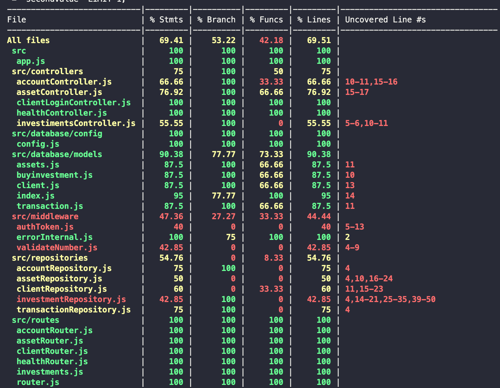
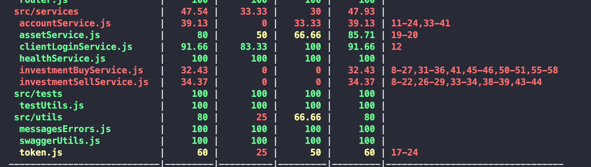
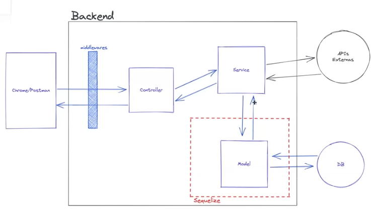

# Desafio Tecnico XP - Aplicação BackEnd 

---

##  📍 Introdução

  
<strong>O que é o projeto?</strong>

  O projeto é uma aplicação backEnd, desenvolvida para o desafio técnico da XP. 
     
  O meu projeto possui uma Application Programming Interface-API, sendo que o objetivo de uma API é disponilizar dados para que outros sistemas possam utilizar, ou seja o backEnd gerencia os dados do banco de dados e fornece ao frontEnd, atraves das requisições HTTP. 
     
  E com as arquitetura REST é feito a separação da responsabilidade do usuario e do servidor, pois toda a comunicação é feita através dos endpoints e na minha aplicação também foi feita a utlização de token que visa a segurança no acesso e na manipulação dos dados disponbilizados, o que é muito importante por se tratar de uma aplicação financeira.
  
 No projeto eu criei uma pipeline utilizando o gitHub actions e o heroku e clean DB, a cada commit realizado na branchMain, automaticamente uma nova versão era deployada no ambiente de produçao.

 

  
<strong>Quais foram as dependencias utilizadas?</strong>

  
  * Node
  * Express
  * Nodemon
  * Chai
  * Mocha
  * Express AssyncErros
  * Sinon
  * Sequelize
  * Dotenv
  * CommitLint
  * Prettier
  * Husky
  * Eslint
  * Mysql2
  * Swagger
  * Cors
  * Docker

 

---

## 📍 Como executar o projeto

  

    
<strong>Rodando o projeto localmente</strong>

  Para rodar o projeto localmente você precisa fazer o clone da aplicação:
       
       git@github.com:Luana0308/chalenge-stock-back-xp.git

  No terminal: 

    npm install
    npm start

   
  

  

    
<strong>Deploy do Projeto</strong>

  Realizei o deploy do projeto no Heroku que é uma Paas, pois ele provém de uma plataforma em nuvem, configurei com as variaveis de ambiente para que a minha aplicação e um banco de dados dentro do heroku. 

  Endpoint das ações: 

  - https://stock-challenge-back-end-xp.herokuapp.com/assets

   
  

  

    
<strong>Swagger do Projeto</strong>

  No projeto adicionei o swagger para poder facilitar a visualizar quais os endpoints da aplicação.

  - https://stock-challenge-back-end-xp.herokuapp.com/doc/

   
  

  
  
  ---

## 📍 Informações sobre o projeto

  
<strong>Cobertura dos testes</strong>

     
   
   
 

  
<strong>Arquitetura Utilizada</strong>

  No projeto eu utilizei a arquitetura de Software do MSC, para poder organizar o projeto. 
  
  A camada C  é a controler que é a interface mais proxima do usuario, que processar e chamar as devidas funções. 

  A camada S é onde fica as regras de negocio, ou seja como deve ser as decisões daquela requisiçõa. 

  A camada M é a model onde entram as conexões com o banco de dados, no meu projeto eu coloquei a camada repositories para poder fazer a conexão com a Model do Sequelize. 

 

  
<strong>Porque utilizei o docker</strong>

  
  O Docker foi utilizado para que a minha aplicação pudesse rodar em qualquer maquina, sem o conflito de versões diferentes dependendo do computador. E também com o Docker a aplicação não ocupa tanto espaço. 

 

  
<strong>Porque utilizei o Sequelize</strong>

  No projeto foi utilizado uma aplicação ORM, que uma forma mais simples de interagir com o banco de dados atraves do codigo de javaScript, e com a ORM não é mais necessário escrever uma query ao SQL de forma crua pois a ORM realiza essa query.

  A ORM que eu escolhi foi a sequelize, que possui o padrão active record que é possivel criar relação e associação entre as tabelas no proprio javaScript.   

  A imagem de uma arquitetura com o sequelize, na qual baseie o meu projeto. A imagem foi retirada da aula de Sequelize da Trybe. 
  

 

  
<strong>Porque utilizei o ESlint/Prettier e CommitLint </strong>

  Utilizei a padronização com o ESLint, pois ele é uma otima ferramente que busca identrifcar os erros do padrão de codigo de acordo com aquilo que defini, e isso ajuda muito a manter um codigo mais organizado. 

  E para ajudar a manter esses padroes que defini eu coloquei o prettier que formata o meu codigo de acordo com essas regras. 

  E ainda pensando em padronização utilizei também o commitLint, que respeita as especificações do conventional Commits e dessa forma fica muito mais facil identificar o que foi realizado durante o desenvolvimento. 

 

  
<strong>Porque utilizei a verificação com JWT</strong>

  
  O JWT é um json web token, que é gerado a partir dos nosso dados pessoais e que pode ser usado para fazer as requisições a API. 

  Nesse projeto eu utilizei o JWT que é uma maneira de obter a identidade do usuário com segurança, e eu faço a validação no login que gera o token e depois utilizo ele em varias rotas.

 

  
<strong>Dificuldades Superadas</strong>

  
  - Configurar o setup da aplicação
  - Desenhar o banco de dados e como criar as rotas baseadas nas informações recebidas
  - Realizar o deploy no heroku com o banco de dados e as variaveis de ambiente
  - Configurar as actions no gitHub. 
  - Criação do swagger
  - Criação dos testes
  - CI/CD
  - Criação de pipeline no GitHub Actions

 

---

## 📍 Referencias

  
<strong>CommitLint</strong>

     
https://github.com/goldbergyoni/nodebestpractices/blob/master/README.brazilian-portuguese.md#3-pr%C3%A1ticas-de-estilo-de-c%C3%B3digo

https://github.com/conventional-changelog/commitlint

https://medium.com/linkapi-solutions/conventional-commits-pattern-3778d1a1e657

https://dev.to/vitordevsp/padronizacao-de-commit-com-commitlint-husky-e-commitizen-3g1n

 

  
<strong>Eslint</strontng>

  
   https://eslint.org/docs/latest/user-guide/getting-started
  
   https://eslint.org/docs/latest/user-guide/configuring/rules#using-configuration-files
  
   https://github.com/lo1tuma/eslint-plugin-mocha/blob/master/docs/rules/no-mocha-arrows.md
  
   https://eslint.org/docs/latest/rules/func-names
  
   https://github.com/mysticatea/eslint-plugin-node/blob/master/docs/rules/no-missing-import.md

   https://dev.to/drsimplegraffiti/eslint-configuration-for-node-project-275l

   https://blog.bitsrc.io/how-to-set-up-node-js-application-with-eslint-and-prettier-b1b7994db69f

 

  
<strong>Mocha e Chai</strontng>

     
  https://stackoverflow.com/a/60492240
  
  https://mochajs.org/#installation

  https://www.npmjs.com/package/sinon

  https://www.npmjs.com/package/mocha

  https://jonathanwatsonwebdevelopment.medium.com/how-to-unit-test-express-controllers-with-mocha-and-chai-5cb425c5c7db

  https://stackoverflow.com/questions/39747397/how-to-use-sinon-js-with-express-js-unit-testing

  https://www.npmjs.com/package/supertest

  https://sinonjs.org/how-to/stub-dependency/

  https://stackoverflow.com/questions/48931815/sinon-stub-not-replacing-function

  https://sinonjs.org/releases/latest/stubs/

 

  
<strong>Heroku e Docker Async-Erros</strontng>

  
  https://dev.to/heroku/deploying-to-heroku-from-github-actions-29ej
  
  https://devcenter.heroku.com/articles/container-registry-and-runtime#dockerfile-commands-and-runtime
  
  https://enlear.academy/how-to-deploy-a-dockerized-web-app-to-heroku-using-the-github-actions-f16c00b19621

  https://www.npmjs.com/package/express-async-errors
     

 

  
<strong>Swagger</strontng>

     
   https://github.com/davibaltar/example-swagger-autogen
  
   https://github.com/scottie1984/swagger-ui-express
  
   https://blog.logrocket.com/documenting-your-express-api-with-swagger/
  

 

  
  

  
<strong>Sequelize<strontng>

     
   https://sequelize.org/docs/v6/other-topics/migrations/#:~:text=Undoing%20Migrations%E2%80%8B&text=You%20can%20use%20db%3Amigrate,revert%20most%20the%20recent%20migration.&text=You%20can%20revert%20back%20to,with%20the%20%2D%2Dto%20option.
    
   https://davibaltar.medium.com/documenta%C3%A7%C3%A3o-autom%C3%A1tica-de-apis-em-node-js-eb03041c643b
  

 

